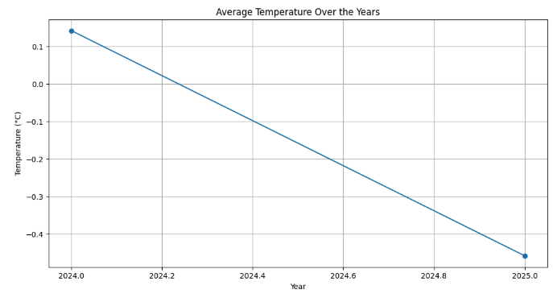
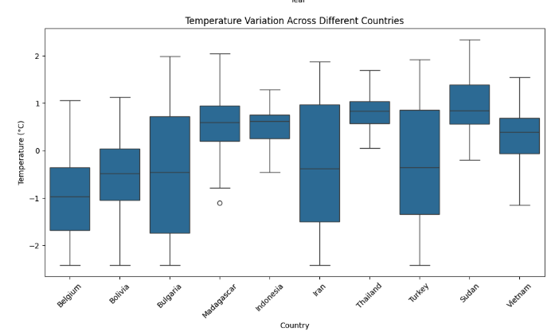
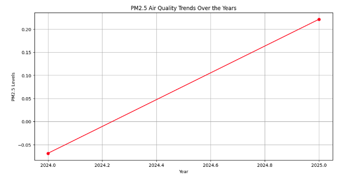
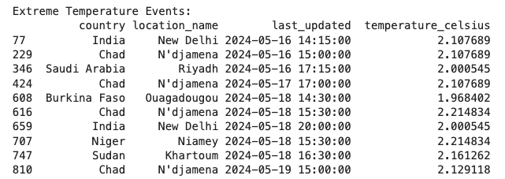

# Climate Analysis Report

## Overview
This report presents a data-driven analysis of long-term climate patterns based on normalized weather data collected from various regions. The analysis focuses on key metrics such as temperature trends, regional climate variations, air quality trends, and extreme weather events.

---

## 1. Temperature Trends Over the Years

### **Observations:**
- A **notable decline** in average temperature is observed from 2024 to 2025.
- The trend suggests a cooling pattern in the available dataset, which may be attributed to specific environmental or meteorological factors.
- Further analysis with a broader time range is needed to determine whether this trend is a short-term fluctuation or part of a larger climate shift.

---

## 2. Regional Temperature Variations

### **Observations:**
- The boxplot indicates significant **temperature variations** across different countries.
- **Bulgaria, Iran, and Sudan** exhibit a wider range of temperature fluctuations, possibly due to diverse climates within these regions.
- Some countries, like **Belgium and Bolivia**, have a narrower spread, indicating relatively stable temperature conditions.
- The presence of outliers suggests occasional extreme temperature events in certain locations.

---

## 3. PM2.5 Air Quality Trends

### **Observations:**
- A clear **increase** in PM2.5 levels is observed from 2024 to 2025, indicating a **deterioration in air quality**.
- This upward trend may suggest increased industrial activities, wildfires, or seasonal effects leading to worsening pollution.
- Further investigation into **regional PM2.5 variations** could help pinpoint the sources of pollution spikes.

---

##  4. Extreme Temperature Events

### **Observations:**
- Extreme high-temperature events were recorded in **India, Chad, Saudi Arabia, Burkina Faso, Niger, and Sudan**.
- **New Delhi and N'djamena (Chad)** appear multiple times, indicating recurring extreme heat conditions in these regions.
- Such events could be linked to heatwaves, urban heat islands, or climate anomalies.
- Monitoring these locations for future occurrences is crucial for developing **early warning systems** and **climate adaptation strategies**.

---

## Conclusion
This climate study reveals:
 A **cooling trend** in average temperature over the observed period.
 Significant **regional temperature variations**, with some countries experiencing extreme fluctuations.
 A **deterioration in air quality**, specifically increasing **PM2.5 levels**.
 Multiple occurrences of **extreme temperature events**, particularly in India and Chad.

 **Future Recommendations:**
- Extend the dataset to analyze trends over a longer period.
- Incorporate additional climate variables like **precipitation and wind patterns**.
- Use machine learning models to **predict future climate changes** based on historical data.

---

 **Author: Jinhua Yang** 
 **Date:** March 13, 2025

