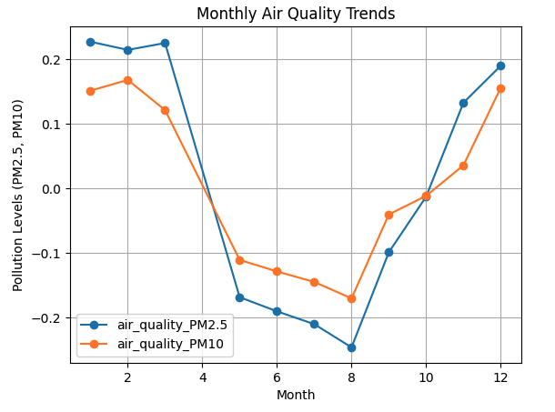
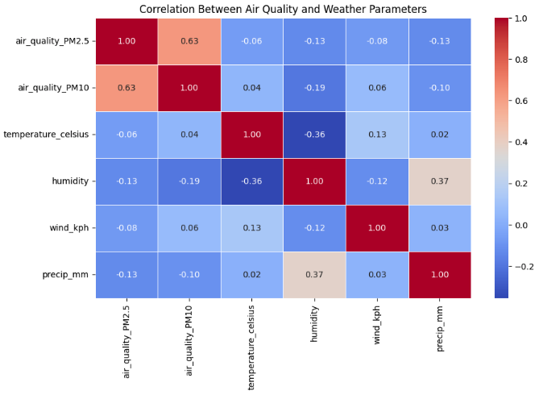
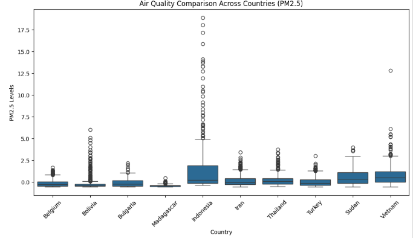

#  Environmental Impact Analysis Report

##  Overview
This report investigates the relationship between air quality (PM2.5, PM10) and various weather parameters, analyzing:
1. **Air Quality Time Series Trends** – Observing seasonal variations.
2. **Correlation Between Air Quality and Weather Parameters** – Identifying key meteorological factors affecting pollution levels.
3. **Air Quality Comparison Across Countries** – Highlighting regional differences.

---

##  1. Air Quality Time Series Trends

###  **Observations:**
- PM2.5 and PM10 levels exhibit a **clear seasonal pattern**.
- Pollution levels **peak in the early months of the year (Jan - Mar)** and **decrease around mid-year (Jun - Aug)**.
- A sharp **increase in air pollution is observed towards the end of the year (Sep - Dec)**, potentially due to seasonal effects like winter inversion or increased emissions.

---

##  2. Correlation Between Air Quality and Weather Parameters

###  **Key Insights from the Correlation Matrix:**
- **PM2.5 and PM10 are highly correlated (0.63)**, indicating that both pollutants often increase together, likely from the same sources (e.g., industrial emissions, traffic).
- **Temperature (-0.06 with PM2.5, 0.04 with PM10):** Very weak correlation, suggesting temperature alone does not directly impact air pollution.
- **Humidity (-0.13 with PM2.5, -0.19 with PM10):** Slight **negative correlation**, meaning higher humidity is linked to lower pollutant levels, possibly due to particle absorption by moisture.
- **Wind Speed (-0.08 with PM2.5, 0.06 with PM10):** Weak correlation, though wind could influence pollution dispersal in some cases.
- **Precipitation (-0.13 with PM2.5, -0.10 with PM10):** **Negative correlation**, implying rain helps clean the air by removing particulate matter.

####  **Key Takeaway:**
- **Humidity and precipitation have the most noticeable negative effect on air pollution**, which aligns with the expectation that rain washes pollutants out of the atmosphere.
- **Wind does not show a strong impact**, which may be due to local geography affecting air circulation.
- **Temperature alone is not a major determinant of air pollution levels**.

---

##  3. Air Quality Comparison Across Countries

###  **Observations:**
- **Indonesia has significantly higher PM2.5 levels compared to other countries**, with extreme outliers indicating episodes of severe pollution.
- Countries like **Belgium, Bolivia, and Bulgaria** have relatively low pollution levels with fewer outliers.
- **Sudan, Vietnam, and Turkey** exhibit moderate pollution with occasional spikes, possibly due to urbanization and industrial activity.

---

##  Conclusion
 **Seasonal effects play a crucial role in pollution trends**, with higher pollution in winter and lower levels in mid-year.
 **Humidity and precipitation are the most influential weather factors negatively correlating with PM2.5 and PM10.**
 **Some regions, like Indonesia, experience significantly worse air pollution compared to others.**

 **Future Recommendations:**
- Analyze pollution control policies in highly polluted regions like **Indonesia** to identify effective mitigation strategies.
- Investigate **localized wind patterns** to understand why wind speed shows a weak correlation with air quality.
- Conduct **hourly air pollution analysis** to detect diurnal pollution patterns.

---

**Author:Jinhua Yang** Automated Air Quality Analysis by Data Science Tools  

**Date:** March 13, 2025

