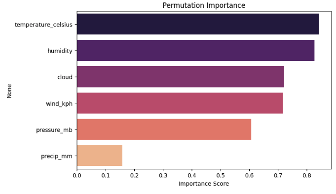

# Feature Importance Analysis Report

## Overview
This analysis explores the importance of different meteorological factors in predicting **PM2.5 air quality levels**. We applied multiple feature importance techniques to gain a well-rounded understanding of how weather parameters influence air pollution.

---

## 1. Correlation-Based Feature Importance

### **Observations:**
- **Cloud cover** and **humidity** show the strongest negative correlation with PM2.5, suggesting that increased cloudiness and humidity may help reduce pollution levels.
- **Precipitation (rainfall)** also has a **negative correlation**, indicating that rainfall can help cleanse the air by removing particulate matter.
- **Pressure (pressure_mb)** is the only variable with a slight **positive correlation**, but its effect is weaker than other factors.
- **Wind speed (wind_kph) and temperature have weak correlations**, suggesting their influence on PM2.5 is not straightforward.

---

## 2. Tree-Based Feature Importance (Random Forest)

### **Observations:**
- **Temperature is the most important feature**, according to Random Forest, even though it showed weak correlation in the previous method. This suggests a **non-linear** relationship.
- **Humidity and wind speed are also highly influential**, indicating their role in dispersing or trapping pollutants.
- **Precipitation has the lowest importance score**, likely because it is not always present in the dataset and has a more indirect impact.

---

## 3. Permutation Importance

### **Observations:**
- **Temperature and humidity again rank as the most important features**, further confirming their role in air pollution variations.
- **Cloud cover and wind speed also play significant roles**, likely influencing pollutant dispersion.
- **Precipitation remains the least impactful**, consistent with previous methods.

---

## 4. Mutual Information (MI) Importance

### 🔎 **Observations:**
- **Cloud cover is the most informative feature**, indicating that changes in cloudiness have a strong impact on air quality.
- **Humidity, wind speed, and temperature follow closely**, reinforcing their roles in pollutant concentration.
- **Precipitation and pressure show moderate importance**, suggesting they still contribute but to a lesser extent.

---

## Conclusion
**Temperature, humidity, and cloud cover are the most influential weather factors affecting PM2.5 levels** across multiple methods.
**Wind speed also contributes significantly**, likely impacting pollutant dispersion.
**Precipitation has a minor effect**, but it can still help reduce pollution during rainy periods.
**Correlation alone does not fully explain feature importance**; tree-based and permutation methods highlight complex interactions.

**Future Recommendations:**
- Conduct further analysis using **non-linear models (e.g., XGBoost, Neural Networks)** to understand temperature’s role better.
- Investigate **seasonal effects** to see how feature importance shifts across different times of the year.
- Apply **causal inference techniques** to determine whether specific weather conditions actively drive changes in pollution levels.

---

**Author:Jinhua Yang**  
**Date:** March 13, 2025

