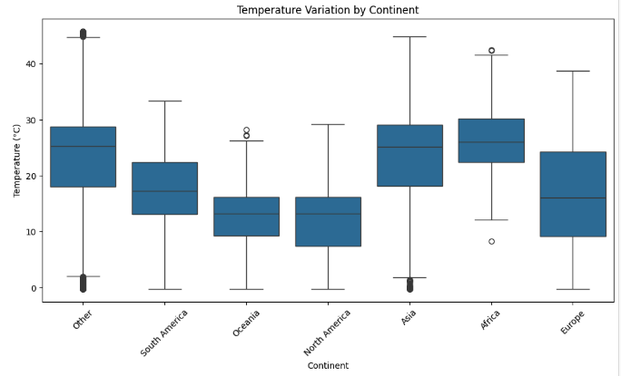
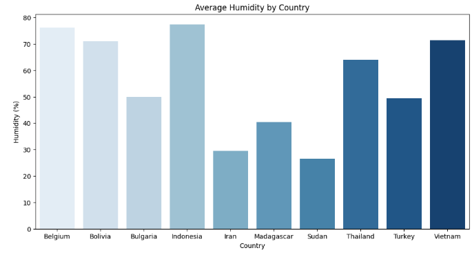
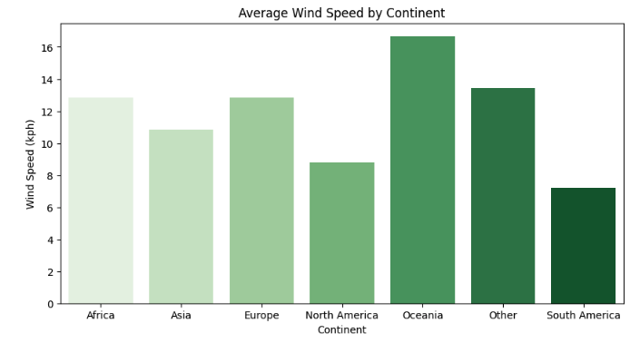
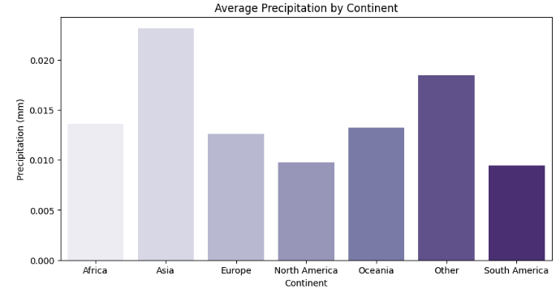

# Geographical Weather Patterns Report

## Overview
This report examines **how weather conditions differ across countries and continents**. The analysis focuses on:
- **Temperature variations by continent** 
- **Humidity levels across countries** 
- **Wind speed variations by continent**
- **Precipitation differences by continent** 

---

##  1. Temperature Variation by Continent

###  **Observations:**
- **Asia and Africa have the highest temperature variability**, with extreme values reaching above **40°C**.
- **North America and Oceania experience moderate temperatures**, mostly within **0-30°C**.
- **Europe and South America have a narrower temperature range**, with relatively stable conditions.
- The **'Other' category** includes regions not classified into major continents, showing a mix of temperature variations.

---

##  2. Average Humidity by Country

###  **Observations:**
- **Indonesia has the highest average humidity**, exceeding **75%**.
- **Belgium and Bolivia also exhibit high humidity levels** above **70%**.
- **Sudan and Iran have the lowest humidity**, below **30%**, indicating drier climates.
- **Vietnam and Thailand show mid-to-high humidity**, reflecting their tropical climates.

---

##  3. Average Wind Speed by Continent

###  **Observations:**
- **Oceania experiences the highest wind speeds**, reaching an average of **16 kph**.
- **Europe and Africa have moderate wind speeds**, around **12 kph**.
- **South America has the lowest average wind speed**, below **8 kph**, suggesting relatively calm atmospheric conditions.
- **North America shows slightly lower wind speeds than Europe**, indicating possible geographical influences.

---

##  4. Average Precipitation by Continent

###  **Observations:**
- **Asia has the highest average precipitation**, exceeding **0.02 mm** per observation period.
- **Europe, Oceania, and Africa show similar levels of precipitation**, indicating comparable rainfall distribution.
- **South America experiences the lowest precipitation**, suggesting drier conditions in major regions.
- **The 'Other' category also shows relatively high precipitation**, possibly including tropical islands and coastal regions.

---

##  Conclusion
 **Asia and Africa exhibit the most extreme temperature variations**, while **Europe and South America** remain more stable.
 **High humidity levels are found in tropical regions like Indonesia and Thailand**, whereas **Sudan and Iran** are significantly drier.
 **Oceania experiences the highest wind speeds**, while **South America has the calmest atmospheric conditions**.
 **Asia receives the most precipitation**, whereas **South America has the least rainfall**.

 **Future Recommendations:**
- Conduct a **seasonal analysis** to understand **how these trends evolve over time**.
- Explore **regional microclimates** that might affect temperature and precipitation variability.
- Use **satellite weather data** to validate and enhance these geographical insights.

---

📝 **Author:Jinhua Yang** 
📅 **Date:** March 13, 2025

