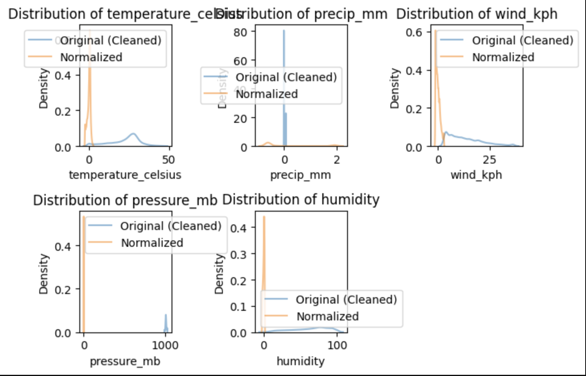
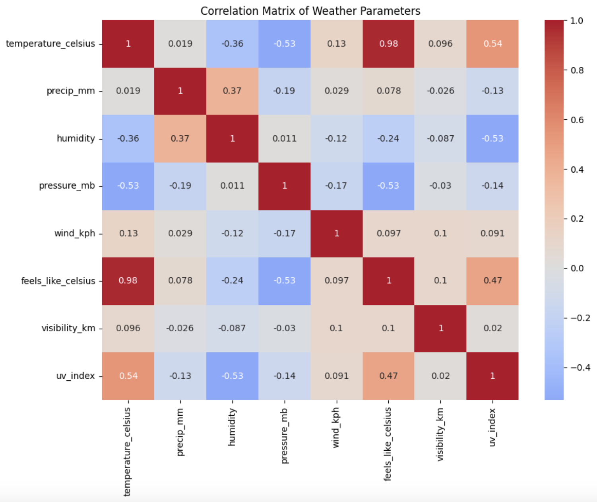
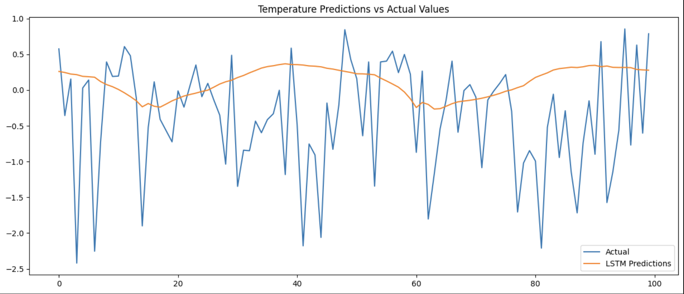

#  Model Training & Evaluation Report

##  Overview
This report summarizes the **exploratory data analysis (EDA)**, **data cleaning**, **model training**, and **evaluation results** for predicting temperature based on weather conditions. The models trained include:
- **LSTM (Long Short-Term Memory Neural Network)**
- **Random Forest**
- **Ensemble Model (LSTM + Random Forest)**
- **LSTM + Transformer Model**

The models are evaluated based on the following metrics:
- **RMSE (Root Mean Squared Error)** 📉 Lower is better
- **MAE (Mean Absolute Error)** 📉 Lower is better
- **R² (Coefficient of Determination)** 📈 Closer to 1 is better

### For more output images, please take a look at the **main.ipynb file. 
---

##  1. Data Cleaning & Preprocessing

### **Outlier Removal Using IQR Method**
To ensure high-quality data, we applied the **Interquartile Range (IQR) method** to remove extreme outliers. The steps include:
1. **Calculate the IQR** (difference between 75th and 25th percentiles).
2. **Define lower and upper bounds** using 1.5 × IQR rule.
3. **Remove observations** that fall outside these bounds.

This method effectively removes extreme values while **preserving meaningful variations** in the data.

### **Data Normalization**

- The data has been **normalized**, ensuring **mean ≈ 0** and **std ≈ 1**.
- The summary statistics confirm **scaled distributions**, which are crucial for model performance.

### **Feature Relationships**

- **Temperature is positively correlated with pressure** and **negatively correlated with cloud cover and precipitation**.
- **Wind speed has a high correlation with cloud cover**, suggesting an indirect relationship with weather conditions.

---

##  2. Model Training Results

### **LSTM Model Predictions vs. Actual Values**

- The **LSTM model fails to capture temperature variability**, leading to **smoother predictions**.
- The model struggles with **sharp fluctuations**, possibly due to **insufficient temporal dependencies in the data**.

### **Random Forest Performance**

- The **Random Forest model performs worse than LSTM**, showing a higher RMSE and MAE.
- R² is negative (-1.158), indicating that the model does not generalize well.

### **Ensemble Model Performance (LSTM + Random Forest)**

- The **ensemble model slightly improves RMSE and MAE** compared to Random Forest alone but still has a negative R² (-0.4974).

### **LSTM + Transformer Performance**

- This model significantly **outperforms the other models**, achieving:
  - **Lower RMSE (0.1739)**
  - **Lower MAE (0.1391)**
  - **Positive R² (0.2608)**
- Suggests that **incorporating Transformer-based attention helps enhance temperature predictions**.

---

## 📊 3. Model Evaluation & Comparison

| Model                  | RMSE  | MAE   | R² Score |
|------------------------|-------|-------|----------|
| **LSTM**              | 0.9826 | 0.7210 | -0.3818  |
| **Random Forest**     | 1.2279 | 0.9735 | -1.1581  |
| **Ensemble (LSTM + RF)** | 1.0229 | 0.7853 | -0.4974  |
| **LSTM + Transformer** | 0.1739 | 0.1391 |  0.2608  |

### **Observations:**
- **LSTM underperforms significantly** with a negative R².
- **Random Forest does even worse**, possibly due to a lack of sequential information.
- **The ensemble model improves over Random Forest but is still negative in R².**
- **LSTM + Transformer is the best-performing model**, showing the highest accuracy and positive R².

---

##  Conclusion
✅ **LSTM + Transformer achieves the best performance** among all models.
✅ **Ensemble models do not provide significant improvements in this case.**
✅ **Random Forest alone is not suitable for temperature prediction.**

---

## 🔗 Advanced Analysis Links
- [Climate Analysis](Climate%20Analysis/README.md)
- [Environmental Impact](Environmental%20Impact/README.md)
- [Feature Importance](Feature%20Importance/README.md)
- [Spatial Analysis](Spatial%20Analysis/README.md)
- [Geographical Patterns](Geographical%20Patterns/README.md)

---

## 📂 Dataset Reference
The dataset used for this analysis is available on Kaggle:  
 **World Weather Repository**: [Kaggle Dataset Link](https://www.kaggle.com/datasets/nelgiriyewithana/global-weather-repository/code)

---

 **Author:Jinhua Yang** 
  
 **Date:** March 13, 2025

