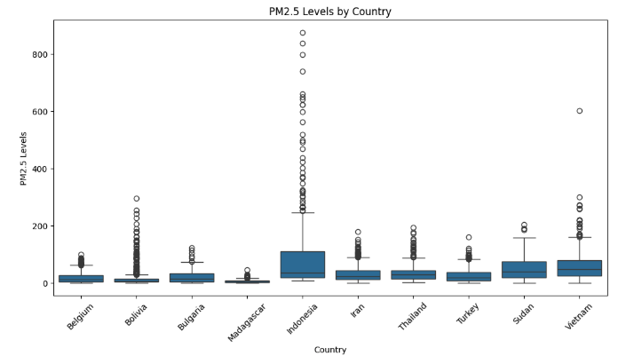
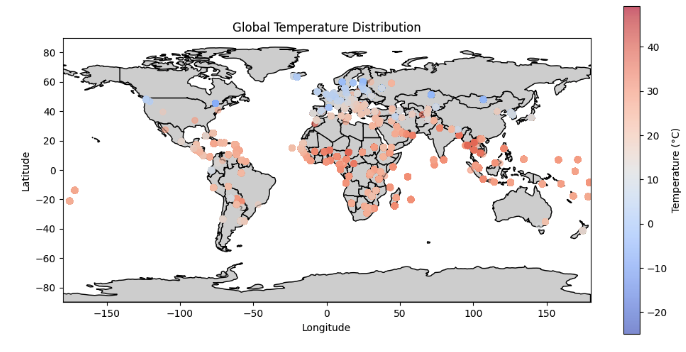
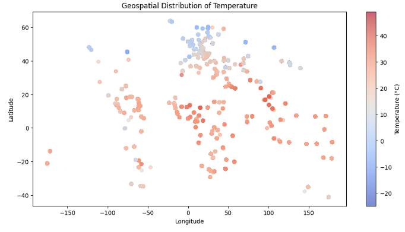

# Spatial Analysis Report

## Overview
This analysis explores the **geographical distribution of temperature and air quality (PM2.5)**. The visualizations highlight:
- **Global temperature distribution** across different latitudes and longitudes.
- **Geospatial PM2.5 variation** to identify regions with high pollution levels.
- **Country-wise air pollution comparison** for regional insights.

---

## 1. PM2.5 Levels by Country

###  **Observations:**
- **Indonesia has the highest PM2.5 levels**, with many extreme outliers exceeding **800+**.
- Other countries like **Vietnam, Sudan, and Turkey** show moderate PM2.5 levels with occasional spikes.
- Countries such as **Belgium, Bolivia, and Bulgaria** have relatively **low pollution levels**, with a narrower range of PM2.5 values.
- The large variability in **Indonesia** suggests periodic pollution spikes, possibly due to **seasonal fires, industrial emissions, or urbanization effects**.

---

##  2. Global Temperature Distribution

###  **Observations:**
- The **temperature distribution aligns with expected global climate patterns**:
  - **Tropical regions (near the equator)** show **higher temperatures** (red shades).
  - **Northern regions (Europe, Canada, Russia)** have **colder temperatures** (blue shades).
- The **warmest areas** are seen around **Africa, South America, and Southeast Asia**.
- The **coldest regions are concentrated in Northern Europe and Canada**.
- The **temperature scale ranges from -20°C to over 40°C**, reflecting the dataset’s diverse geographical coverage.

---

## 3. Geospatial Distribution of Temperature

###  **Observations:**
- The temperature distribution follows a clear **latitudinal pattern**:
  - **Northern latitudes (above 50°N)** show a **strong concentration of cold temperatures**.
  - **Equatorial and tropical zones** have **higher temperature clusters**.
- Some **localized hot spots** suggest **urban heat island effects** or **regional climate variations**.
- The spatial clustering suggests that **temperature correlates well with geographical location**, but **local environmental factors** might introduce deviations.

---

## Conclusion
 **PM2.5 pollution is highest in Indonesia, with significant outliers.**
 **Temperature variations are strongly linked to latitude**, with colder temperatures in the north and higher temperatures near the equator.
 **Certain regions experience extreme pollution spikes**, which may be linked to seasonal factors or industrial activity.

 **Future Recommendations:**
- Conduct a **seasonal analysis** of PM2.5 to detect trends over time.
- Investigate **urban vs. rural temperature differences** to assess heat island effects.
- Use **satellite-based pollution data** for further validation of air quality trends.

---

 **Author:Jinhua Yang** 
 **Date:** March 13, 2025

